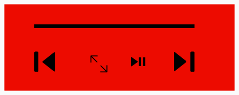

# Projeto Embarcados

Desenvolvendo um controle remoto.

## Entrega 1

### Integrantes

- Willian Kenzo
- Thiago Shiguero
### Ideia

Um controle bluetooth para controlar o youtube do seu computador/notebook sem precisar estar perto para controlar ,adicionando flexibilidade para o usuário, sem contar com botões analógicos dando uma resposta tátil, melhorando o feedback e sensação ao clicar.
### Nome

Youol

### Usuários 

Diversas pessoas gostam da sensação de um botão preferindo um feedback tátil ao de membrana, que é o comum nos computadores. Além de não precisar estar próximo para controlar o seu vídeo/música no youtube, adicionando versatilidade.  

### Software/Jogo 

Youtube 

### Jornada do usuários (3 pts)

Jornada 1
O usuário chega em sua casa depois de um dia exaustante, com um uso intensivo do celular, acabando sua bateria e gostaria de assistir alguns episódios de AEROPORTO com casimiro para relaxar, entretanto como não tem bateria para utilizar o celular, ele escolhe deixar o celular carregando e liga seu noteboo. Pelo notebook não ser uma das melhores opções para se assistir deitado, ele escolhe em conectar o notebook na tv pelo HDMI e utilizar o Youol para poder controlar os vídeos deitado no seu sofá, colocando full screen ou até pulando algum vídeo.

Jornada 2

O usuário durante uma festa em sua casa, esquece que seu spotify é free e escolhe então usar o youtube para suas playlists pelo notebook conectado a uma caixa bluetoothh, entretanto para não precisar o notebook exposto com bebidas do lado, com o perigo de cair algo nele/deixar o notebook melado, escolhe utilizar o Youol para resolver esse problema. Com o Youol ele consegue que o notebook fique seguro e o ajuste de som é feito de forma sem preocupação por parte do usuário, até um maior feedback pelo fato dos botões táteis diminuindo as chances de clicar errado.

### Comandos/ Feedbacks (2 pts)

Pular vídeo -> feedback: feedback sonoro
Controle de volume -> feedback: por ser um sensor slider, o próprio sensor trará um feedback ao usuário representando um volume de 0 a 100
Parar vídeo -> feedback: feedback sonoro
Full Screen -> feedback: pisca um led1 mostrando que trocou
Randomizar fila -> feedback: led2 acesso mostrando que a opção está ativada

## In/OUT (3 pts)

Pular vídeo: Push button verde
Parar vídeo: Push button vermelho
Full Screen: push button azul
Volume da música: slider
Randomizar fila: Push button amarelo

### Design (2 pts)

  
